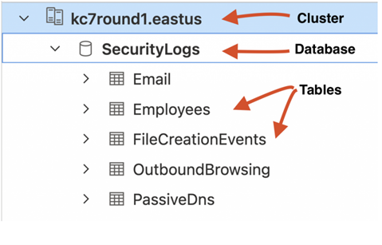
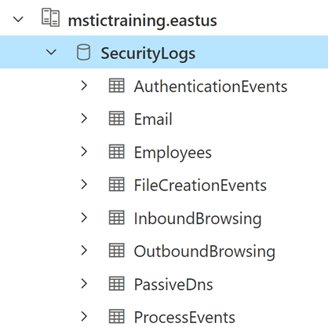
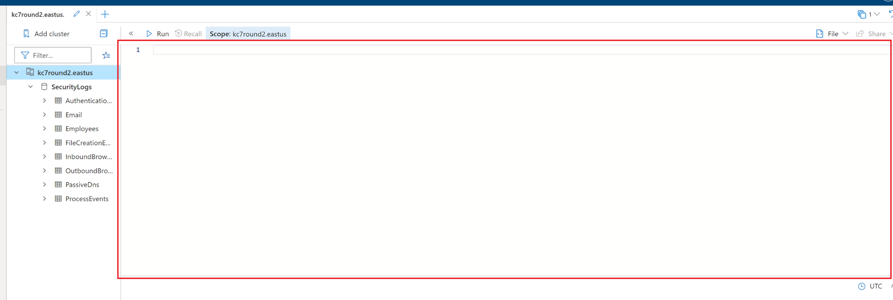
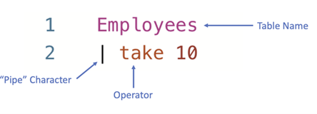

# 💡 Module 1: KQL 101

## Overview
**Difficulty**: Beginner  
**Prerequisites**: None  
**Time to Complete**: 30-45 mins

This module will introduce you to Azure Data Explorer (ADX) and get you comfortable using the Kusto Query Language (KQL) to analyze security log data.

## Objectives

After completing this module, you should be able to:

- Use Azure Data Explorer for analysis of security log data
- Apply KQL fundamentals to answer targeted questions using data
- Pivot across multiple datasets

## Legend

🎯Key Point – Occasionally, you will see a dart emoji with a “key point.” These signal explanations of certain concepts that may enhance your understand of key cybersecurity ideas that are demonstrated in the game. 

🤔Question – “Thinking” emojis represent questions that will enable you to demonstrate mastery of the concepts at hand. You can earn points by entering your responses to questions from this module in the scoring portal available at https://kc7cyber.azurewebsites.net/

🤫 Hint – “Whisper” emojis represent in-game hints. These hints will guide you in the right direction in answering some of the questions. 

# Introduction: Welcome to Envolve Labs!

Welcome to Envolve Labs Corporation! 🥳 Today is your first day as a Junior Security Operations Center (SOC) Analyst with our company. Your primary job responsibility is to defend Envolve Labs and its employees from malicious cyber actors. 


Envolve Labs is a med-tech startup based in the United States that was founded in 2012. Our mission is to develop a new type of flexible vaccine technology that covers many different viral strains and offers long-lasting immunity (which means no more boosters!) Our initial research has proven this technology is highly effective – we’re planning to start production in Q1 2023. 

Like all good companies, Envolve Labs collects log data about the activity its employees perform on the corporate network. These security audit logs are stored in Azure Data Explorer (ADX) - a data storage service in Azure (Microsoft’s cloud). You will use the Kusto Query Language (KQL) to parse through various types of security logs. By analysing these logs, you can help us determine whether we’re being targeted by malicious actors. 

You can find full documentation on ADX [here](https://docs.microsoft.com/en-us/azure/data-explorer/kusto/query/tutorial?pivots=azuredataexplorer).

# Getting Started in Azure Data Explorer (ADX)

ADX is the primary tool used in the Envolve Labs SOC for data exploration and analysis. The great thing about ADX is that it is used by cyber analysts at many of the smallest and largest organizations in the world. 

[Click here](https://dataexplorer.azure.com/clusters/mstictraining.eastus/databases/SecurityLogs) to get access to ADX and load the data you'll need for this module. Once you click this link, you'll need to sign in with a Microsoft account. If you don't already have one, you'll be able to create a new one there.

Data in ADX is organized in a hierarchical structure which consists of clusters, databases, and tables. All of Envolve Labs’s security logs are stored in a single cluster.



🚨**IMPORTANT NOTE**: For this module, make sure you've selected the _SecurityLogs_ database. You should see the database highlighted in blue when you've selected it.



The big blank space to the right of your cluster list is the query workspace. That’s where you’ll actually write the queries used to interact with our log data. 



Okay, enough introductions… let’s get your hands on the data.

## First Look at the Data

First look at the data…

The SecurityLogs database contains eight tables. Tables contain many rows of similar data. For security logs, a single row typically represents a single thing done by an employee or a device on the network at a particular time.

We currently have eight types of log data. As you’ll see in ADX, each log type corresponds to a table that exists in the SecurityLogs database:

| **Table Name**            | **Description**                                                                                                            |
| ------------------------- | -------------------------------------------------------------------------------------------------------------------------- |
| **Employees**             | Contains information about the company’s employees                                                                         |
| **Email**                 | Records emails sent and received by employees                                                                              |
| **InboundBrowsing**       | Records browsing activity from the Internet to devices within the company network                                          |
| **OutboundBrowsing**      | Records browsing activity from within the company network out to the Internet                                              |
| **AuthenticationEvents**  | Records successful and failed logins to devices on the company network. This includes logins to the company’s mail server. |
| **FileCreationEvents**    | Records files stored on employee’s devices                                                                                 |
| **ProcessEvents**         | Records processes created on employee’s devices                                                                            |
| **PassiveDns (External)** | Records IP-domain resolutions           

> 🎯**Key Point – Over the Horizon (OTH) data:** One of the tables listed above is not like the others – PassiveDns. Rather than being an internal security log, PassiveDns is a data source that we’ve purchased from a 3rd party vendor. Not all malicious cyber activity happens within our company network, so sometimes we depend on data from other sources to complete our investigations.

You’ll learn more about how to use each of these datasets in just a minute. First, let’s just run some queries so you can practice using KQL and ADX.

# KQL 101

Type the following query in the workspace to view the first rows in the Employees table. Press “run” or “shift + enter” to execute the query.

```kusto
Employees
| take 10
```
[Run this query in ADX](https://dataexplorer.azure.com/clusters/mstictraining.eastus/databases/SecurityLogs?query=H4sIAAAAAAAAA3PNLcjJr0xNLeblqlEoScxOVTA0AADuIW0/FAAAAA==)

This query has a few parts. Let’s take a moment to break each of them down:



| **Query Component**    | **Description**                                                                                                                                                                                                                                                                                  |
| ---------------------- | ------------------------------------------------------------------------------------------------------------------------------------------------------------------------------------------------------------------------------------------------------------------------------------------------ |
| **Table name**         | The table name specifies which table/data source the query will pull data from. All queries must start with a table.                                                                                                                                                                             |
| **Pipe character (\|)** | The pipe character indicates the start of a new part of the query. A pipe will be added automatically after typing a table name and pressing enter. You can also add a pipe character manually by holding shift and pressing the backslash key. That’s the one just below the backspace key. |
| **Operator**           | The operator tells the query what exactly you want to do. The first operator you’ve learned is take, which simply _takes_ a given number of rows and shows you the data there.

You’ll learn and practice using more operators soon!

The `take` operator is a powerful tool you can use to explore rows in a table, and therefore better understand what kinds of data are stored there.

>**🎯Key Point – What to do when you don’t know what to do:** Whenever you are faced with an unfamiliar database table, the first thing you should do is sample its rows using the `take` operator. That way, you know what fields are available for you to query and you can guess what type of information you might extract from the data source.

The `Employees` table contains information about all the employees in our organization. In this case, we can see that the organization is named _“Envolve Labs”_ and the domain is _“envolvelabs.com”_.

> 1. 🤔 Try it for yourself! Do a `take 10` on all the other tables to see what kind of data they contain.

You can easily write multiple queries in the same workspace tab. To do this, make sure to separate each query by an empty line. Notice below how we have separated the queries for the Employees, Email, and OutboundBrowsing tables by empty lines on lines 3 and 6.
