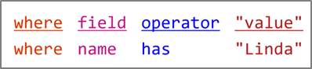
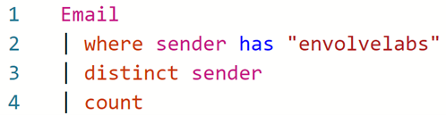
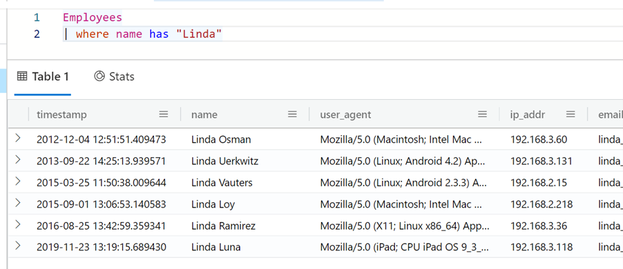
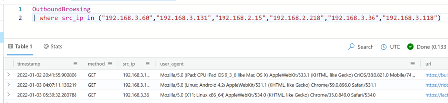
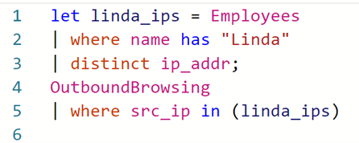
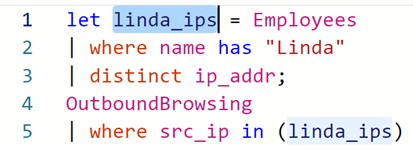
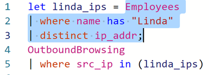
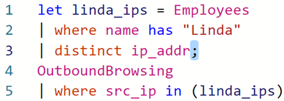

# 💡 Module 1: KQL 101

## Overview
**Difficulty**: Beginner  
**Prerequisites**: None  
**Time to Complete**: 30-45 mins

This module will introduce you to Azure Data Explorer (ADX) and get you comfortable using the Kusto Query Language (KQL) to analyze security log data.

## Objectives

After completing this module, you should be able to:

- Use Azure Data Explorer for analysis of security log data
- Apply KQL fundamentals to answer targeted questions using data
- Pivot across multiple datasets


## Legend

🎯Key Point – Occasionally, you will see a dart emoji with a “key point.” These signal explanations of certain concepts that may enhance your understand of key cybersecurity ideas that are demonstrated in the game. 

🤔Question – “Thinking” emojis represent questions that will enable you to demonstrate mastery of the concepts at hand. You can earn points by entering your responses to questions from this module in the scoring portal available at https://kc7cyber.azurewebsites.net/

🤫 Hint – “Whisper” emojis represent in-game hints. These hints will guide you in the right direction in answering some of the questions. 

# Introduction: Welcome to Envolve Labs!

Welcome to Envolve Labs Corporation! 🥳 Today is your first day as a Junior Security Operations Center (SOC) Analyst with our company. Your primary job responsibility is to defend Envolve Labs and its employees from malicious cyber actors. 


Envolve Labs is a med-tech startup based in the United States that was founded in 2012. Our mission is to develop a new type of flexible vaccine technology that covers many different viral strains and offers long-lasting immunity (which means no more boosters!) Our initial research has proven this technology is highly effective – we’re planning to start production in Q1 2023. 

Like all good companies, Envolve Labs collects log data about the activity its employees perform on the corporate network. These security audit logs are stored in Azure Data Explorer (ADX) - a data storage service in Azure (Microsoft’s cloud). You will use the Kusto Query Language (KQL) to parse through various types of security logs. By analysing these logs, you can help us determine whether we’re being targeted by malicious actors. 

You can find full documentation on ADX [here](https://docs.microsoft.com/en-us/azure/data-explorer/kusto/query/tutorial?pivots=azuredataexplorer).

# Getting Started in Azure Data Explorer (ADX)

ADX is the primary tool used in the Envolve Labs SOC for data exploration and analysis. The great thing about ADX is that it is used by cyber analysts at many of the smallest and largest organizations in the world. 

[Click here](https://dataexplorer.azure.com/clusters/mstictraining.eastus/databases/SecurityLogs) to get access to ADX and load the data you'll need for this module. Once you click this link, you'll need to sign in with a Microsoft account. If you don't already have one, you'll be able to create a new one there.

Data in ADX is organized in a hierarchical structure which consists of clusters, databases, and tables. All of Envolve Labs’s security logs are stored in a single cluster.


>🚨**IMPORTANT NOTE**: For this module, make sure you've selected the _SecurityLogs_ database. You should see the database highlighted in blue when you've selected it.


The big blank space to the right of your cluster list is the query workspace. That’s where you’ll actually write the queries used to interact with our log data. 


Okay, enough introductions… let’s get your hands on the data.

## First Look at the Data

First look at the data…

The SecurityLogs database contains eight tables. Tables contain many rows of similar data. For security logs, a single row typically represents a single thing done by an employee or a device on the network at a particular time.

We currently have eight types of log data. As you’ll see in ADX, each log type corresponds to a table that exists in the SecurityLogs database:

| **Table Name**            | **Description**                                                                                                            |
| ------------------------- | -------------------------------------------------------------------------------------------------------------------------- |
| **Employees**             | Contains information about the company’s employees                                                                         |
| **Email**                 | Records emails sent and received by employees                                                                              |
| **InboundBrowsing**       | Records browsing activity from the Internet to devices within the company network                                          |
| **OutboundBrowsing**      | Records browsing activity from within the company network out to the Internet                                              |
| **AuthenticationEvents**  | Records successful and failed logins to devices on the company network. This includes logins to the company’s mail server. |
| **FileCreationEvents**    | Records files stored on employee’s devices                                                                                 |
| **ProcessEvents**         | Records processes created on employee’s devices                                                                            |
| **PassiveDns (External)** | Records IP-domain resolutions           

> 🎯**Key Point – Over the Horizon (OTH) data:** One of the tables listed above is not like the others – PassiveDns. Rather than being an internal security log, PassiveDns is a data source that we’ve purchased from a 3rd party vendor. Not all malicious cyber activity happens within our company network, so sometimes we depend on data from other sources to complete our investigations.

You’ll learn more about how to use each of these datasets in just a minute. First, let’s just run some queries so you can practice using KQL and ADX.

# KQL 101

Type the following query in the workspace to view the first rows in the Employees table. Press “run” or “shift + enter” to execute the query.

```kusto
Employees
| take 10
```
[Run this query in ADX](https://dataexplorer.azure.com/clusters/mstictraining.eastus/databases/SecurityLogs?query=H4sIAAAAAAAAA3PNLcjJr0xNLeblqlEoScxOVTA0AADuIW0/FAAAAA==)

This query has a few parts. Let’s take a moment to break each of them down:


| **Query Component**    | **Description**                                                                                                                                                                                                                                                                                  |
| ---------------------- | ------------------------------------------------------------------------------------------------------------------------------------------------------------------------------------------------------------------------------------------------------------------------------------------------ |
| **Table name**         | The table name specifies which table/data source the query will pull data from. All queries must start with a table.                                                                                                                                                                             |
| **Pipe character (\|)** | The pipe character indicates the start of a new part of the query. A pipe will be added automatically after typing a table name and pressing enter. You can also add a pipe character manually by holding shift and pressing the backslash key. That’s the one just below the backspace key. |
| **Operator**           | The operator tells the query what exactly you want to do. The first operator you’ve learned is take, which simply _takes_ a given number of rows and shows you the data there.

You’ll learn and practice using more operators soon!

The `take` operator is a powerful tool you can use to explore rows in a table, and therefore better understand what kinds of data are stored there.

>**🎯Key Point – What to do when you don’t know what to do:** Whenever you are faced with an unfamiliar database table, the first thing you should do is sample its rows using the `take` operator. That way, you know what fields are available for you to query and you can guess what type of information you might extract from the data source.

The `Employees` table contains information about all the employees in our organization. In this case, we can see that the organization is named _“Envolve Labs”_ and the domain is _“envolvelabs.com”_.

> 1. 🤔 Try it for yourself! Do a `take 10` on all the other tables to see what kind of data they contain.

You can easily write multiple queries in the same workspace tab. To do this, make sure to separate each query by an empty line. Notice below how we have separated the queries for the Employees, Email, and OutboundBrowsing tables by empty lines on lines 3 and 6.


When you have multiple queries, it’s important to tell ADX which query you want to run. To choose a query, just click on any line that is part of that query. Once you’ve selected a query, it will be highlighted in blue, as seen on lines 4 and 5 above.

#

## Finding Out How Many: The `count` Operator

We can use `count` to see how many rows are in a table. This tells us how much data is stored there.  

```kusto
Employees
| count
```

> 2. 🤔How many employees are in the company?

## Filtering Data with the `where` Operator

So far, we’ve run queries that look at the entire contents of the table. Often in cybersecurity analysis, we only want to look at data that meets a set of conditions or criteria. To accomplish this, we apply filters to specific columns.

We can use the where operator in KQL to apply filters to a particular field. For example, we can find all the employees with the name “Linda” by filtering on the name column in the Employees table. 

`where` statements are written using a particular structure. Use this helpful chart below to understand how to structure a `where` statement.



```kusto
Employees
| where name has "Linda"
```

The `has` operator is useful here because we’re looking for only a partial match. If we wanted to look for an employee with a specific first and last name (an exact match), we’d use the `==` operator: 

```kusto
Employees
| where name == "Linda Holbert"
```

> 3. 🤔Each employee at Envolve Labs is assigned an IP address. Which employee has the IP address: “192.168.0.191”?

While performing their day-to-day tasks, Envolve Labs employees send and receive emails. A record of each of these emails is stored in the Email table. 

> 🎯Key Point – User Privacy and Metadata: As you can imagine, some emails are highly sensitive. Instead of storing the entire contents of every email sent and received within the company in a database that can be easily accessed by security analysts, we only capture email metadata. 
>
> Email metadata includes information like: the time the email was sent, the sender, the recipient, the subject line, and any links the email may contain. Storing only email metadata, rather than entire contents, helps protect the privacy of our employees, while also ensuring that our security analysts can keep us safe. Sometimes even metadata can reveal sensitive information, so it’s important that you don’t talk about log data with other employees outside the SOC.

We can find information about the emails sent or received by a user by looking for their email address in the sender and recipient fields of the Email table. For example, we can use the following query to see all the emails sent by “Michael Montello”:

```kusto
Email
| where sender == "michael_montello@envolvelabs.com"
```

> 4. 🤔How many emails did Betty Parrish receive?

## Easy as 1, 2, 3… Compound Queries and the `distinct` Operator

We can use the distinct operator to find unique values in a particular column. We can use the following query to determine how many of the organization’s users sent emails.



This is our first time using a multi-line query with multiple operators, so let’s break it down:

- In line 2, we take the Email table and filter the data down to find only those rows with “envolvelabs” in the sender column.

- In line 3, we add another pipe character ( | ) and use the distinct operator to find all the unique senders. Here, we aren’t finding the unique senders for all of the email senders, but only the unique senders that are left after we apply the filter looking for rows with “envolvelabs” in the sender column.

- Finally, in line 4, we add another pipe character ( | ) and then use the count operator to count the results of lines 1-3 of the query.

> 5. 🤔How many users received emails with the term “vaccine” in the subject?

## Tracking Down a Click: OutboundBrowsing Data

When employees at Envolve Labs browse to a website from within the corporate network, that browsing activity is logged. This is stored in the OutboundBrowsing table, which contains records of the websites browsed by each user in the company. Whenever someone visits a website, a record of it stored in the table. However, the user’s name is not stored in the table, only their IP address is recorded. There is a 1:1 relationship between users and their assigned IP addresses, so we can reference the Employees table to figure out who browsed a particular website.  

If we want to figure out what websites Annie Jackson visited, we can find her IP address from the Employees table.

```kusto 
Employees
| where name == "Annie Jackson"
```

The query above tells us her IP address is “192.168.3.168”. We can take her IP address and look in the OutboundBrowsing table to determine what websites she visited. 

```kusto
OutboundBrowsing
| where src_ip == "192.168.3.168"
```

> 6. 🤔How many unique websites did “Keith Mitchell” visit?

## What’s in a Name? All about Passive DNS Data

Although domain names like “google.com” are easy for humans to remember, computers don’t know how to handle them. So, they convert them to machine readable IP addresses. Just like your home address tells your friends how to find your house or apartment, an IP address tells your computer where to find a page or service hosted on the internet.
 
> 🎯Key Point – Practice Good OPSEC: If we want to find out which IP address a particular domain resolves to, we could just browse to it. But, if the domain is a malicious one, you could download malicious files to your corporate analysis system or tip off the attackers that you know about their infrastructure. As cybersecurity analysts, we must follow procedures and safeguards that protect our ability to track threats. These practices are generally called operational security, or OPSEC.

To eliminate the need to actively resolve (that is- directly browse to or interact with a domain to find it’s related IP address) every domain we’re interested in, we can rely on passive DNS data. Passive DNS data allows us to safely explore domain-to-IP relationships, so we can answer questions like:

- Which IP address does this domain resolve to?
- Which domains are hosted on this IP address?
- How many other IPs have this domain resolved to?

These domain-to-IP relationships are stored in our PassiveDns table. 

> 7. 🤔 How many domains in the PassiveDns records contain the word “vaccine”? (hint: use the contains operator instead of has. If you get stuck, do a take 10 on the table to see what fields are available.)

> 8. 🤔 What IPs did the domain “biotechenvolv.science” resolve to?

## 🤯Let statements – making your life a bit easier:

Sometimes we need to use the output of one query as the input for a second query.  The first way we can do this is by manually typing the results into next query.

For example, what if we want to look at all the web browsing activity from employees named “Linda”?

First, you would need to go into the Employees table and find the IP addresses used by these employees.



Then, you could manually copy and paste these IPs into a query against the OutboundBrowsing table. Note that we can use the in operator to choose all rows that have a value matching any value from a list of possible values. In other words, the == (comparison) operator looks for an exact match, while the in operator checks for any values from the list.



Although this is a valid way to get the information you need, it may not be as elegant (or timely) if you had 100 or even 1000 employees named “Linda.”

We can accomplish this in a more elegant way by using a let statement, which allows us to assign a name to an expression or a function. We can use a let statement here to save and give a name to the results of the first query so that the values can be re-used later. That means we don’t have to manually type or copy and paste the results repeatedly.



On the left of the let statement is the variable name (“linda_ips” in this case). The variable name can be whatever we want, but it is helpful to make it something meaningful that can help us remember what values it is storing. 



On the right side of the let statement in the expression you are storing. In this case, we use the distinct operator to select values from only one column – so they are stored in an array – or list of values. 



The let statement is concluded by a semi-colon.



After we store the value of a query into a variable using the let statement, we can refer to it as many times as we like in the rest of the query. The stored query does not show any output. Remember, however, that your KQL query must have a tabular statement – which means that you must have another query following your let statement. 

> 9. 🤔 How many unique URLs were browsed by employees named “Karen”?

> 🎯**Key Point – Pivoting:** Part of being a great cyber analyst is learning how to use multiple data sources to tell a more complete story of what an attacker has done. We call this “pivoting.” We pivot by taking one known piece of data in one dataset and looking in a different dataset to learn something we didn’t already know. You practiced this here when we started in one dataset – the Employees table – and used knowledge from there to find related data in another source – OutboundBrowsing. 